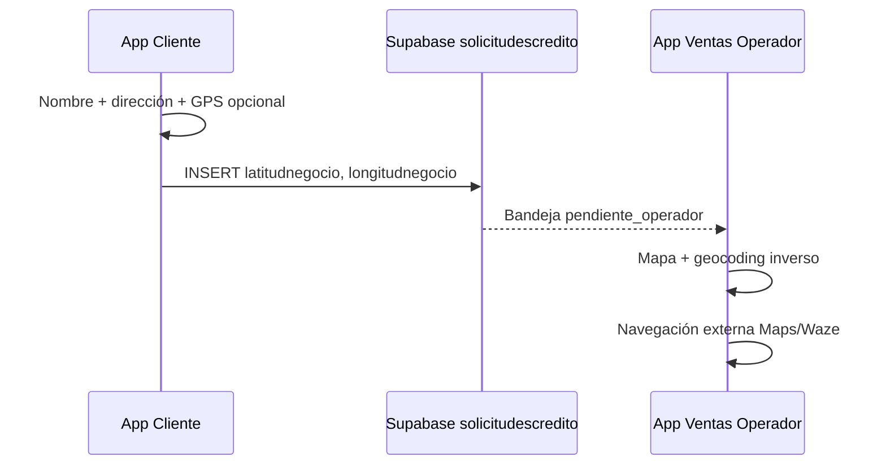

# Ubicación GPS del negocio en solicitudes de crédito

Integración entre **app cliente** (`appbanco_pichincha_cliente`) y **app ventas/operador** (`appbanco_pichincha_ventas`) para registrar y visualizar la ubicación exacta del local del negocio.

---

## Objetivo

Cuando el cliente solicita un crédito, además de nombre y dirección textual del negocio puede registrar **latitud y longitud WGS84**. Esos datos se guardan en Supabase y el operador en la app de ventas puede:

- Ver las coordenadas en la bandeja de solicitudes
- Abrir un mapa con marcador en el wizard de atención
- Comparar la **dirección declarada** con la **dirección cotejada** (geocodificación inversa)
- Abrir navegación en Google Maps / Waze hacia el punto

---

## Base de datos (Supabase)

### Migración

Archivo: `appbanco_pichincha_ventas/supabase/migrations/20260625_solicitud_negocio_coords.sql`

```sql
alter table public.solicitudescredito
  add column if not exists latitudnegocio double precision,
  add column if not exists longitudnegocio double precision;
```

**Aplicar en Supabase** (Dashboard → SQL o CLI):

```bash
cd D:\Flutter\PichinchaApps\appbanco_pichincha_ventas
supabase db push
# o ejecutar el SQL manualmente en el proyecto remoto
```

### Columnas

| Columna           | Tipo              | Origen        | Descripción                          |
|-------------------|-------------------|---------------|--------------------------------------|
| `latitudnegocio`  | double precision  | App cliente   | Latitud decimal (-90 … 90)           |
| `longitudnegocio` | double precision  | App cliente   | Longitud decimal (-180 … 180)        |
| `direccionnegocio`| text (existente)  | App cliente   | Dirección en texto libre             |
| `nombrenegocio`   | text (existente)  | App cliente   | Nombre comercial                     |

Las coordenadas son **opcionales**. Si el cliente no las envía, las columnas quedan en `NULL`.

---

## Flujo de datos



1. Cliente completa solicitud en `SolicitudCreditoScreen` o pre-evaluación.
2. `SolicitudCreditoService.crearSolicitud()` inserta fila con estado `pendiente_operador`.
3. Operador abre **Solicitudes de clientes** → toma la solicitud.
4. `SolicitudCreditoData.fromSupabaseRow()` carga coordenadas.
5. En el paso **Datos del negocio** se muestra `UbicacionNegocioMapaPanel`.

---

## App cliente — archivos tocados

| Archivo | Rol |
|---------|-----|
| `lib/app/core/coordenadas_util.dart` | Validación lat/lng |
| `lib/app/ui/widgets/coordenadas_negocio_input.dart` | UI: GPS manual o “Usar mi ubicación” |
| `lib/app/model/solicitud_credito_model.dart` | Campos `latitudNegocio`, `longitudNegocio` |
| `lib/app/services/solicitud_credito_service.dart` | Envío a Supabase |
| `lib/app/view/solicitudes/solicitud_credito_screen.dart` | Formulario principal |
| `lib/app/view/simulador/preevaluacion_screen.dart` | Pre-evaluación → solicitud |
| `lib/app/view/solicitudes/detalle_solicitud_screen.dart` | Muestra coords al cliente |
| `pubspec.yaml` | Dependencia `geolocator` |
| `android/.../AndroidManifest.xml` | Permisos ubicación |
| `ios/Runner/Info.plist` | `NSLocationWhenInUseUsageDescription` |

### Payload de insert (cliente)

```dart
{
  'nombrenegocio': 'Bodega El Sol',
  'direccionnegocio': 'Jr. Los Olivos 120, Huancayo',
  'latitudnegocio': -12.066412,
  'longitudnegocio': -75.213789,
  'estado': 'pendiente_operador',
  'origen': 'app_cliente',
  // ... resto de campos
}
```

---

## App ventas — archivos tocados

| Archivo | Rol |
|---------|-----|
| `lib/app/model/solicitud_credito_data.dart` | Modelo + `tieneCoordenadasNegocio` |
| `lib/app/services/solicitud_bandeja_cliente_service.dart` | SELECT incluye coords |
| `lib/app/view/home/bandeja_solicitudes_cliente_screen.dart` | Badge GPS en tarjeta |
| `lib/app/view/home/solicitud_credito_wizard_screen.dart` | Mapa en paso 2 y confirmación |
| `lib/app/ui/widgets/ubicacion_negocio_mapa_panel.dart` | Mapa OSM + geocoding + navegación |

### Servicios reutilizados (ventas)

- `GeocodingService` — dirección desde coordenadas (`geocoding` package)
- `NavegacionExternaService` — Waze / Google Maps (`url_launcher`)
- `flutter_map` + OpenStreetMap — mismo stack que cartera y rutas

---

## Cotejo de dirección (operador)

En `UbicacionNegocioMapaPanel` se muestran dos textos:

1. **Dirección declarada por el cliente** → campo `direccionnegocio`
2. **Dirección cotejada** → resultado de `placemarkFromCoordinates(lat, lng)`

El operador puede contrastar si la referencia escrita coincide con el punto GPS (útil para visitas de campo y fraude).

---

## Pruebas recomendadas

### 1. Migración

- [ ] Columnas `latitudnegocio` y `longitudnegocio` existen en `solicitudescredito`
- [ ] INSERT manual con coords funciona desde SQL Editor

### 2. App cliente

- [ ] Solicitud con solo dirección (sin GPS) — debe guardar OK
- [ ] Solicitud con “Usar mi ubicación actual” en dispositivo físico
- [ ] Solicitud con lat/lng manual (ej. `-12.0664`, `-75.2137`)
- [ ] Detalle de solicitud muestra coordenadas si existen

### 3. App ventas

- [ ] Bandeja muestra línea verde `GPS: lat, lng` cuando hay coords
- [ ] Al tomar solicitud, paso Negocio muestra mapa
- [ ] “Dirección cotejada” se resuelve (requiere internet)
- [ ] Botón “Ir con mapas / Waze” abre app externa

### 4. Regresión

- [ ] Solicitudes antiguas sin coords siguen funcionando (`NULL` en BD)
- [ ] Operador completa wizard y actualiza solicitud sin borrar coords

---

## Coordenadas de ejemplo (Huancayo)

| Campo | Valor |
|-------|--------|
| Latitud | `-12.066400` |
| Longitud | `-75.213700` |

Copiar desde Google Maps: mantener pulsado el mapa → “Coordenadas”.

---

## Notas técnicas

- Sistema de referencia: **WGS84** (estándar GPS).
- Validación cliente: lat ∈ [-90, 90], lng ∈ [-180, 180].
- Geocodificación inversa depende del servicio del SO / `geocoding`; puede fallar sin red.
- Mapas en ventas usan tiles OSM; no requieren API key de Google.
- Si el operador edita la dirección en el wizard, las coordenadas **no se recalculan** automáticamente (permanecen las enviadas por el cliente).

---

## Rutas de los proyectos

- Cliente: `D:\Flutter\PichinchaApps\appbanco_pichincha_cliente`
- Ventas: `D:\Flutter\PichinchaApps\appbanco_pichincha_ventas`

Ambas apps comparten el mismo proyecto Supabase y la tabla `public.solicitudescredito`.
